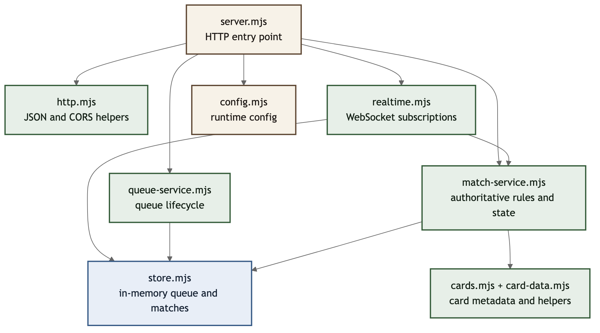
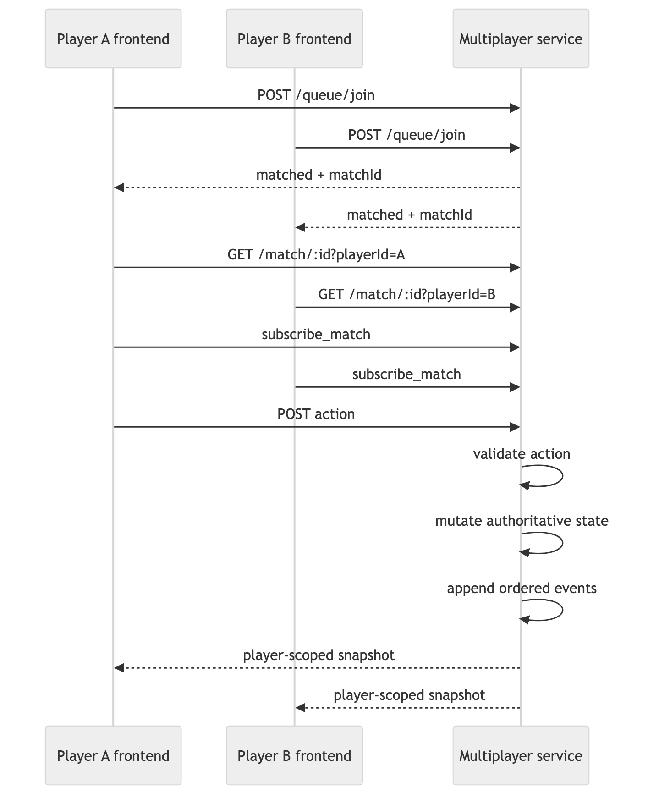
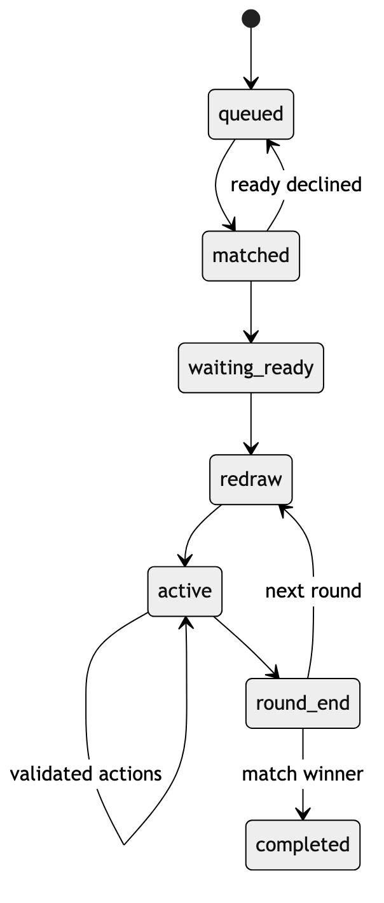

# Backend Architecture

This document describes the backend architecture for `gwent-multiplayer-service`.

## Backend module graph

## End-to-end PvP flow

## Match lifecycle

## What this backend owns

- queueing and matchmaking
- match creation
- authoritative PvP state
- turn and redraw deadlines
- hidden-information filtering
- player-scoped state serialization
- action validation
- ordered event logging
- WebSocket push to subscribed players

## Main code entry points

1. [`src/server.mjs`](/Users/dush/Gwent/gwent-multiplayer-service/src/server.mjs)
2. [`src/realtime.mjs`](/Users/dush/Gwent/gwent-multiplayer-service/src/realtime.mjs)
3. [`src/match-service.mjs`](/Users/dush/Gwent/gwent-multiplayer-service/src/match-service.mjs)

## Module responsibilities

- `server.mjs`
  - HTTP routes and service entry point
- `realtime.mjs`
  - WebSocket subscriptions and broadcast fanout
- `queue-service.mjs`
  - queue lifecycle and matchmaking entry management
- `match-service.mjs`
  - authoritative rules, transitions, serialization, and actions
- `store.mjs`
  - in-memory queue and match storage
- `cards.mjs` and `card-data.mjs`
  - card definitions and card helper logic

## Snapshot model

This backend sends player-scoped snapshots, not one shared raw match object.

That means:

- each player receives their own visible hand and deck details
- opponent hidden information is filtered out
- public state stays shared
- event log entries are sanitized where needed

The backend mutates authoritative state first, appends ordered events, and then pushes a fresh player-scoped snapshot to each subscribed client.
